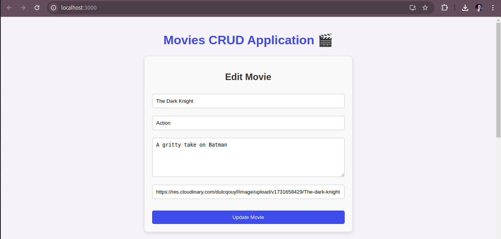
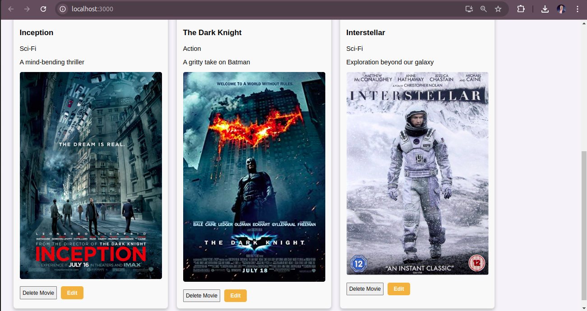

# Movies CRUD Application 🎬

A full-stack CRUD application for managing movies. Built with Express, React, MySQL, and Node.js, this app allows users to add, edit, delete, and view movies with various details like name, genre, description, and poster.

## Table of Contents

-   [Features](#features)
-   [Tech Stack](#tech-stack)
-   [Setup](#setup)
-   [Usage](#usage)
-   [API Endpoints](#api-endpoints)
-   [Folder Structure](#folder-structure)
-   [License](#license)

## Features

-   Add, update, and delete movies.
-   View a list of movies with relevant details.
-   Responsive UI using React.
-   RESTful API with Express and MySQL as the database.
-   Backend and frontend are separated into different folders.

## Tech Stack

-   **Frontend**: React, Axios
-   **Backend**: Node.js, Express
-   **Database**: MySQL
-   **Environment Variables**: dotenv for environment configuration

### SCREENSHOTS

Here is a screenshot of the **Movies-CRUD** application:





## Setup

### Prerequisites

-   Node.js and npm installed
-   MySQL installed and running

### Installation

1. Clone the repository:

    ```bash
    git clone https://github.com/imunreal7/moviesCRUD.git
    cd moviescrud
    ```

2. Install dependencies for both backend and frontend:

    ```bash
    # Backend
    cd backend
    npm install

    # Frontend
    cd ../client
    npm install
    ```

3. Set up environment variables:

    - In the `backend` folder, create a `.env` file:
        ```plaintext
        PORT=8080
        MYSQL_PASSWORD="your_mysql_password"
        ```

4. Configure the MySQL database:

    - Create a new database in MySQL called `movies`.
    - Update the `app.js` file with your MySQL connection details if needed.

5. Start the application:

    - Backend:

        ```bash
        cd backend
        npm start
        ```

    - Frontend:
        ```bash
        cd client
        npm start
        ```

6. Access the application at `http://localhost:3000` for the frontend and `http://localhost:8080` for backend API.

## Usage

1. **Add a movie**: Enter the movie details and submit to add it to the database.
2. **Edit a movie**: Click on the edit button next to a movie to modify its details.
3. **Delete a movie**: Click on the delete button next to a movie to remove it from the database.
4. **View all movies**: The homepage displays a list of all movies in the database.

## API Endpoints

### Base URL

```
http://localhost:8080
```

### Movies

-   **Get all movies**: `GET /movies`
-   **Get movie by ID**: `GET /movies/:id`
-   **Add new movie**: `POST /movies`
    -   Body: `{ "name": "string", "genre": "string", "description": "string", "poster": "string" }`
-   **Add multiple movies**: `POST /movies/bulk`
    -   Body: `{ "movies": [ { "name": "string", "genre": "string", "description": "string", "poster": "string" }, ... ] }`
-   **Update movie by ID**: `PUT /movies/:id`
    -   Body: `{ "name": "string", "genre": "string", "description": "string", "poster": "string" }`
-   **Delete movie by ID**: `DELETE /movies/:id`

## License

This project is licensed under the MIT License.

## Author

Developed by Aman Dubey.

